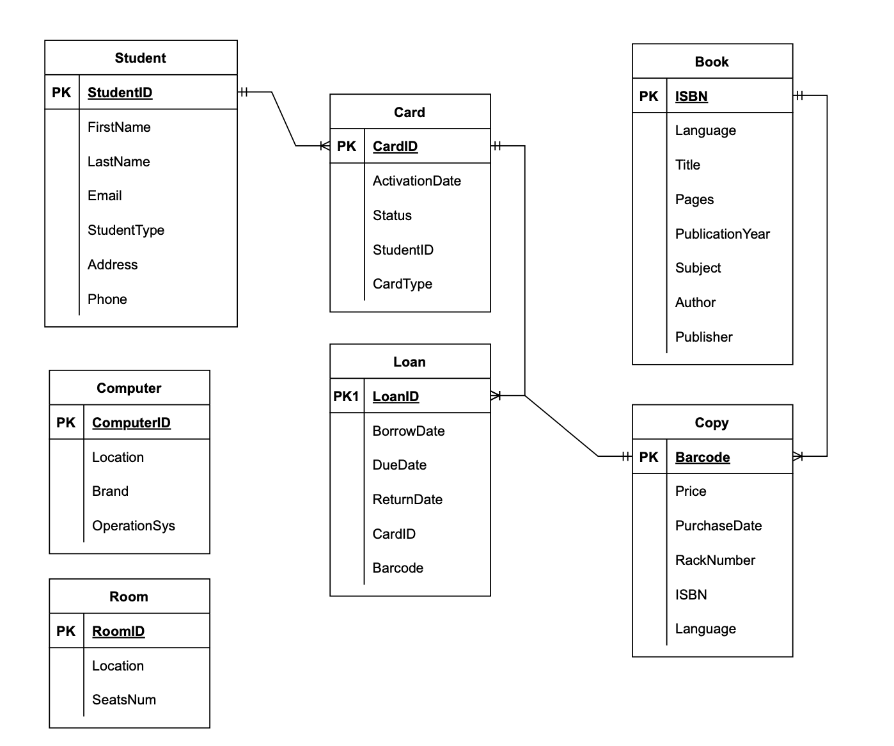

# Library Management System

# Overview

The project focuses on designing and implementing a database system to automate the services of a university library, specifically managing books, student borrowing, and resource tracking. This submission includes the SQL implementation and the Conceptual Data Model (CDM), as required by the project specifications. The database was implemented using **MySQL**

## Project Description

### Objective

The goal of this project is to design a database system to automate the management of a university library's resources, focusing on books, borrowing, and returns. The system tracks student profiles, library cards, book copies, and loans while enforcing constraints such as loan limits and due dates.

### Database Design

- **Conceptual Data Model (CDM)**: Designed as an entity-association diagram using crow's foot notation in draw.io. The CDM includes entities such as Student, Card, Book, Copy, and Loan, with relationships and constraints detailed in the document.

  

- **Structural Constraints**:

  - Primary and foreign keys for referential integrity.
  - Checks (e.g., phone number format, positive page counts).
  - Triggers to enforce business rules (e.g., loan limits, card status, due dates).

- **Database Implementation**: Implemented in MySQL. The script includes:

  - Table creation for Student, Card, Book, Copy, and Loan.
  - Triggers to set default dates, enforce loan limits (5 for registered students, 1 for non-registered), prevent double borrowing, and check card status.
  - Sample data population for testing.
  - Queries to retrieve borrowing information and overdue copies